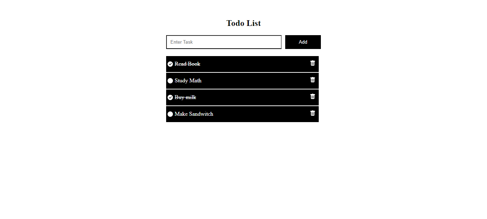

Todo MERN App

A Todo MERN application is a to-do list web app built using the MERN stack. MERN stands for MongoDB (database), Express.js (backend framework), React.js (frontend framework), and Node.js (JavaScript runtime environment).

<br/>

This Todo app allows users to manage their tasks: adding new ones, marking them complete, and potentially editing or deleting existing tasks. It's a great way to practice building a full-stack application using MERN technologies.

[](#)

## Bash Commands

Here are some Bash commands you can use to interact with your project:

* **Command 1:** This command does something specific.
  ```bash
    npm i mongoose
