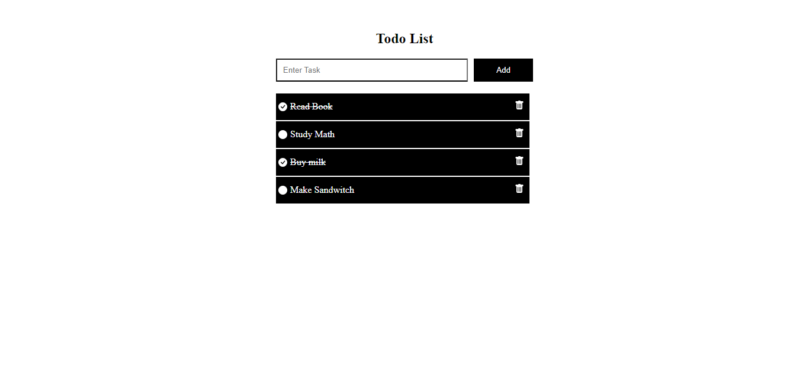

## Todo MERN App

A Todo MERN application is a to-do list web app built using the MERN stack. MERN stands for MongoDB (database), Express.js (backend framework), React.js (frontend framework), and Node.js (JavaScript runtime environment).

<br/>

This Todo app allows users to manage their tasks: adding new ones, marking them complete, and potentially editing or deleting existing tasks. It's a great way to practice building a full-stack application using MERN technologies.

[](#)

## Bash Commands

Here are some Bash commands you can use to interact with your project:

* **Install nodejs on official website:** https://www.nodejs.org

<br/>

* **Create Server side of application in Server path**
  ```bash
    npm init -y

* **Install the following dependencies in server path of project**
  ```bash
    npm i mongoose cors dotenv express nodemon dotenv 

* **Run Server side of application in Server path**
  ```bash
    npm node index.js

* **Create Client side in todolist path of project**
  ```bash
    npm i vite@latest 

* **Run Client side of application in Server path**
  ```bash
    npm run dev

* **Install the following dependencies in todolist path of project**
  ```bash
    npm i react-native icons

****
